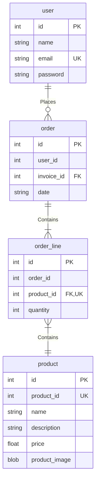

```mermaid
erDiagram
    user ||--o{ order : Places
    user {
        int    id        PK
        string name
        string email     UK
        string password
    }
    
    order ||--|{ order_line : Contains
    order {
        int    id                PK
        int    user_id           
        int    invoice_id        FK
        string date   
    }

    order_line }|--|| product : Contains
    order_line {
        int    id          PK
        int    order_id    
        int    product_id  FK, UK
        int    quantity
}

    product {
        int    id            PK
        int    product_id    UK
        string name
        string description
        float  price
        blob   product_image
    }
        
```
