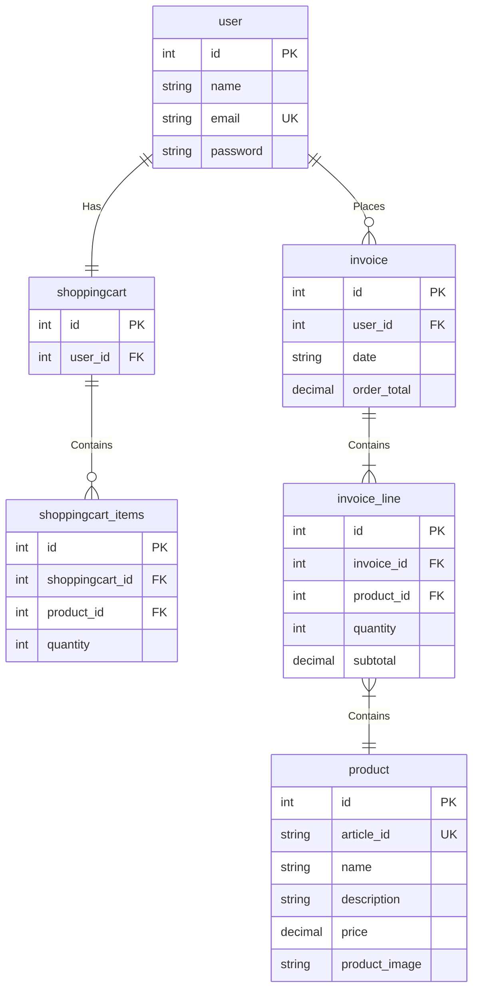

```mermaid
erDiagram
    user ||--o{ invoice : Places
    user ||--|| shoppingcart : Has
    user {
        int    id        PK
        string name
        string email     UK
        string password
    }

    shoppingcart {
        int id         PK
        int user_id    FK
    }

    shoppingcart ||--o{ shoppingcart_items : Contains
    shoppingcart_items {
        int id              PK
        int shoppingcart_id FK
        int product_id      FK
        int quantity
    }
    
    invoice ||--|{ invoice_line : Contains
    invoice {
        int    id                PK
        int    user_id           FK
        string date
        decimal order_total 
    }

    invoice_line }|--|| product : Contains
    invoice_line {
        int        id            PK
        int        invoice_id    FK
        int        product_id    FK
        int        quantity
        decimal    subtotal 
}

    product {
        int     id            PK
        string  article_id    UK
        string  name
        string  description
        decimal price
        string  product_image
    }
        
```
